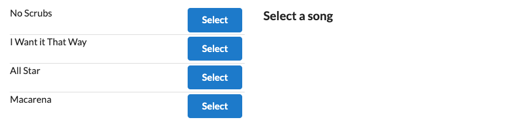
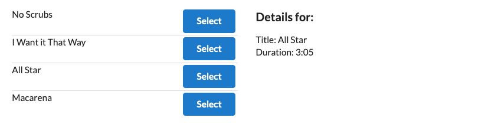

First ever Redux app code-along

Useful stuff in this app:

- all the Redux stuff and whatnot
- configuring and and wrapping <App /> with a <Provider /> component
- reducers
- configuring Connect component with ActionCreator method and passing that to a button using props
- using mapStateToProps to return custom objects from state

Screenshots:

